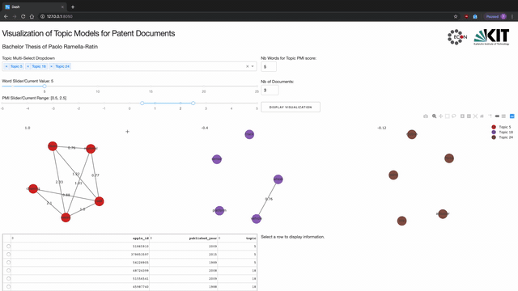

This is my Bachelor thesis as a student of Industrial Engineering and Management at the Karlsruhe Institut of Technology.

The thesis was proposed by the Chair in Economic Policy and aimes at exploring the visualization of topic models trained on patent documents. The exploration culminates in the creation of a tool specifically designed for visualizing said topic models.

Due to the size restrictions I can't upload the data needed to run the project locally. I plan on reducing the data in the future so that I can upload it so you can test my project.

